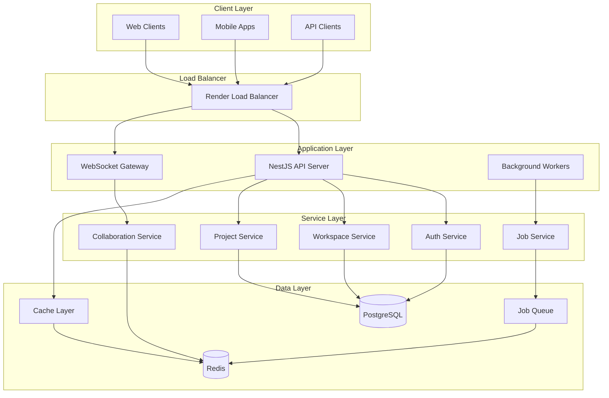
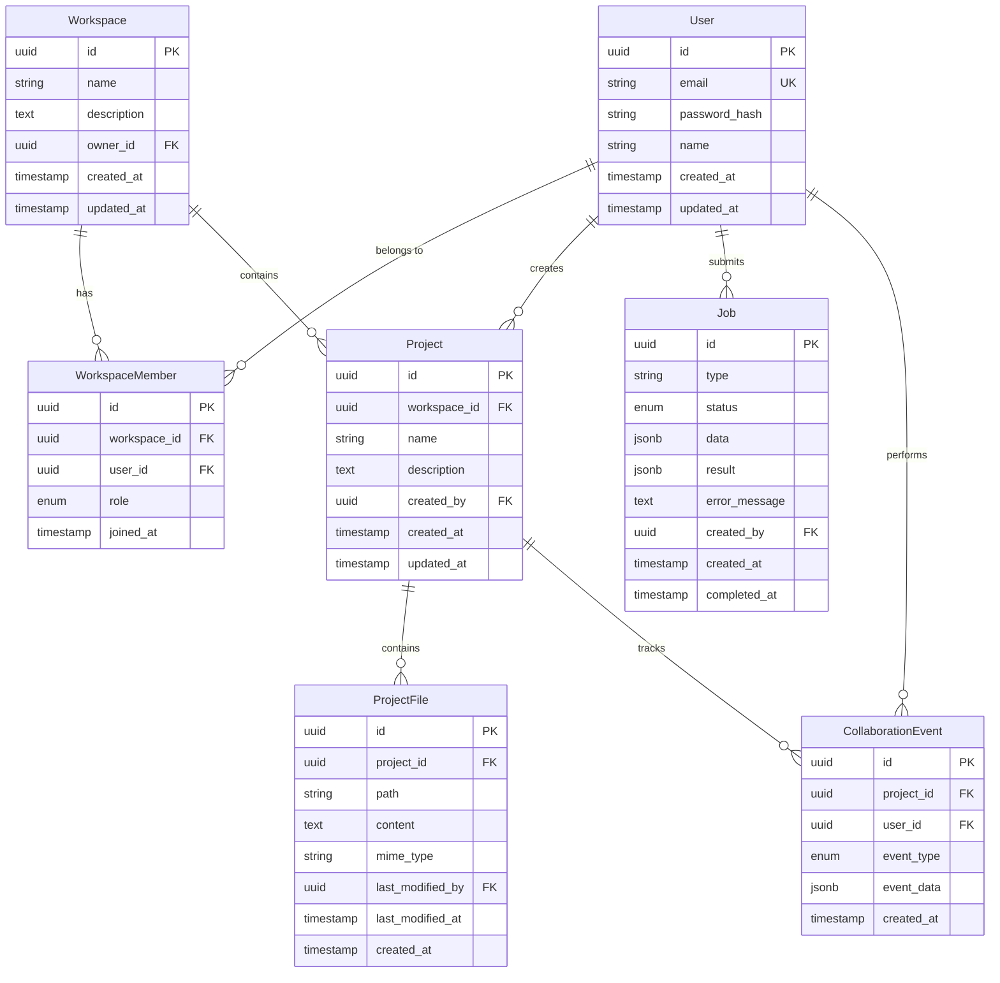
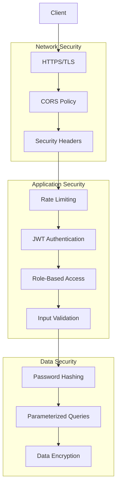
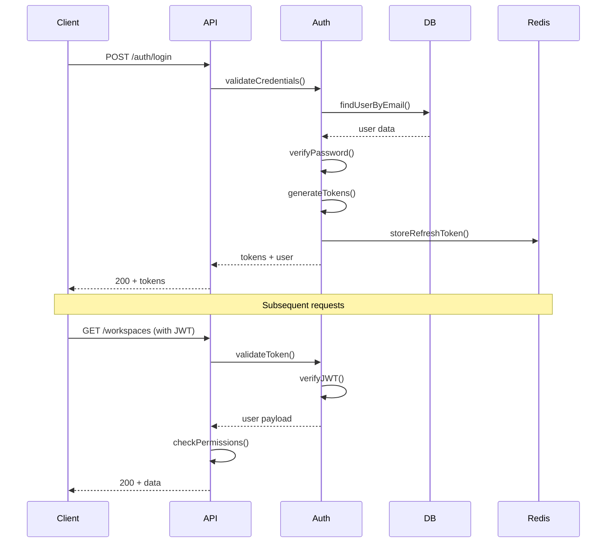
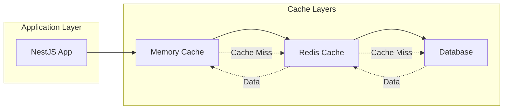
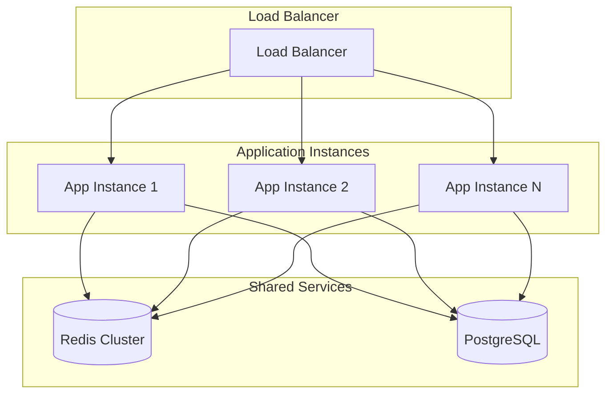

# Architecture Documentation

This document provides a detailed overview of the Collaborative Workspace Backend architecture, design decisions, and implementation patterns.

## Table of Contents

- [System Overview](#system-overview)
- [Architecture Patterns](#architecture-patterns)
- [Module Design](#module-design)
- [Database Architecture](#database-architecture)
- [Security Architecture](#security-architecture)
- [Performance Architecture](#performance-architecture)
- [Scalability Considerations](#scalability-considerations)

## System Overview

The Collaborative Workspace Backend is a production-grade NestJS application designed for real-time collaborative development environments. The system follows Clean Architecture principles with Domain-Driven Design patterns.

### High-Level Architecture



### Technology Stack

| Layer              | Technology            | Purpose                                         |
| ------------------ | --------------------- | ----------------------------------------------- |
| **Framework**      | NestJS 11             | Application framework with dependency injection |
| **Language**       | TypeScript 5.9        | Type-safe development                           |
| **Database**       | PostgreSQL 17         | Primary data storage                            |
| **Cache**          | Redis                 | Caching, sessions, pub/sub                      |
| **Queue**          | BullMQ                | Background job processing                       |
| **WebSocket**      | Socket.io             | Real-time communication                         |
| **Authentication** | JWT + Passport        | Stateless authentication                        |
| **Validation**     | Zod + class-validator | Input validation                                |
| **ORM**            | TypeORM 0.3.28        | Database abstraction                            |
| **Testing**        | Jest + fast-check     | Unit and property-based testing                 |

## Architecture Patterns

### Clean Architecture

The application follows Clean Architecture principles with clear separation of concerns:

```
┌─────────────────────────────────────────────────────────────┐
│                    Presentation Layer                       │
│  Controllers, Gateways, DTOs, Guards, Pipes, Filters      │
├─────────────────────────────────────────────────────────────┤
│                   Application Layer                         │
│     Use Cases, Application Services, Interfaces            │
├─────────────────────────────────────────────────────────────┤
│                     Domain Layer                            │
│      Entities, Domain Services, Business Rules             │
├─────────────────────────────────────────────────────────────┤
│                  Infrastructure Layer                       │
│   Database, Redis, External APIs, File System              │
└─────────────────────────────────────────────────────────────┘
```

### Dependency Injection

NestJS's built-in dependency injection container manages all service dependencies:

```typescript
@Module({
  imports: [TypeOrmModule.forFeature([User, Workspace])],
  providers: [
    {
      provide: 'IUserRepository',
      useClass: TypeOrmUserRepository,
    },
    {
      provide: 'IWorkspaceService',
      useClass: WorkspaceService,
    },
  ],
  controllers: [WorkspaceController],
})
export class WorkspaceModule {}
```

### SOLID Principles Implementation

1. **Single Responsibility Principle**
   - Each service has one clear responsibility
   - Controllers handle HTTP concerns only
   - Services contain business logic

2. **Open/Closed Principle**
   - Services depend on interfaces
   - New implementations can be added without modifying existing code

3. **Liskov Substitution Principle**
   - All implementations follow their interface contracts
   - Services can be replaced with alternative implementations

4. **Interface Segregation Principle**
   - Interfaces are focused and specific
   - No forced dependencies on unused methods

5. **Dependency Inversion Principle**
   - High-level modules depend on abstractions
   - Infrastructure details are injected

## Module Design

### Core Modules

#### Authentication Module

```typescript
@Module({
  imports: [
    JwtModule.registerAsync({
      useFactory: (config: ConfigService) => ({
        secret: config.get('JWT_SECRET'),
        signOptions: { expiresIn: config.get('JWT_EXPIRES_IN') },
      }),
      inject: [ConfigService],
    }),
    PassportModule,
  ],
  providers: [AuthService, JwtStrategy],
  controllers: [AuthController],
  exports: [AuthService],
})
export class AuthModule {}
```

**Responsibilities:**

- User authentication and authorization
- JWT token generation and validation
- Password hashing and verification
- Role-based access control

#### Workspace Module

```typescript
@Module({
  imports: [TypeOrmModule.forFeature([Workspace, WorkspaceMember])],
  providers: [WorkspaceService, PermissionService],
  controllers: [WorkspaceController],
  exports: [WorkspaceService],
})
export class WorkspaceModule {}
```

**Responsibilities:**

- Workspace CRUD operations
- Member management and invitations
- Permission checking
- Role assignment

#### Project Module

```typescript
@Module({
  imports: [TypeOrmModule.forFeature([Project, ProjectFile, CollaborationEvent])],
  providers: [ProjectService, ProjectFileService, CollaborationEventService],
  controllers: [ProjectController],
  exports: [ProjectService],
})
export class ProjectModule {}
```

**Responsibilities:**

- Project CRUD operations
- File management
- Collaboration history tracking
- Project metadata management

#### Collaboration Module

```typescript
@Module({
  imports: [
    RedisModule.forRootAsync({
      useFactory: (config: ConfigService) => ({
        host: config.get('REDIS_HOST'),
        port: config.get('REDIS_PORT'),
      }),
      inject: [ConfigService],
    }),
  ],
  providers: [CollaborationGateway, PresenceService, EventService],
})
export class CollaborationModule {}
```

**Responsibilities:**

- WebSocket connection management
- Real-time event broadcasting
- User presence tracking
- Event persistence

#### Job Module

```typescript
@Module({
  imports: [
    BullModule.forRootAsync({
      useFactory: (config: ConfigService) => ({
        redis: {
          host: config.get('REDIS_HOST'),
          port: config.get('REDIS_PORT'),
        },
      }),
      inject: [ConfigService],
    }),
    BullModule.registerQueue({
      name: 'code-execution',
    }),
  ],
  providers: [JobService, CodeExecutionProcessor, FileProcessingProcessor],
  controllers: [JobController],
})
export class JobModule {}
```

**Responsibilities:**

- Background job processing
- Job queue management
- Job status tracking
- Result persistence

## Database Architecture

### Entity Relationship Diagram



### Database Design Decisions

1. **UUID Primary Keys**
   - Globally unique identifiers
   - Better for distributed systems
   - No sequential enumeration attacks

2. **JSONB for Flexible Data**
   - Event data and job payloads
   - Efficient querying with GIN indexes
   - Schema flexibility for evolving requirements

3. **Normalized Structure**
   - Separate entities for better data integrity
   - Efficient queries with proper indexes
   - Clear relationships and constraints

4. **Audit Trail**
   - Created/updated timestamps on all entities
   - User tracking for modifications
   - Event history for collaboration

### Indexing Strategy

```sql
-- Primary indexes (automatic with PRIMARY KEY)
-- Unique indexes
CREATE UNIQUE INDEX idx_users_email ON users(email);
CREATE UNIQUE INDEX idx_workspace_members_unique ON workspace_members(workspace_id, user_id);

-- Foreign key indexes
CREATE INDEX idx_workspace_members_workspace_id ON workspace_members(workspace_id);
CREATE INDEX idx_workspace_members_user_id ON workspace_members(user_id);
CREATE INDEX idx_projects_workspace_id ON projects(workspace_id);
CREATE INDEX idx_projects_created_by ON projects(created_by);
CREATE INDEX idx_project_files_project_id ON project_files(project_id);
CREATE INDEX idx_collaboration_events_project_id ON collaboration_events(project_id);
CREATE INDEX idx_collaboration_events_user_id ON collaboration_events(user_id);
CREATE INDEX idx_jobs_created_by ON jobs(created_by);

-- Query optimization indexes
CREATE INDEX idx_jobs_status_created_at ON jobs(status, created_at);
CREATE INDEX idx_collaboration_events_type_created_at ON collaboration_events(event_type, created_at);

-- JSONB indexes for efficient querying
CREATE INDEX idx_jobs_data_gin ON jobs USING GIN (data);
CREATE INDEX idx_jobs_result_gin ON jobs USING GIN (result);
CREATE INDEX idx_collaboration_events_data_gin ON collaboration_events USING GIN (event_data);

-- Partial indexes for common queries
CREATE INDEX idx_jobs_pending ON jobs(created_at) WHERE status = 'pending';
CREATE INDEX idx_jobs_processing ON jobs(created_at) WHERE status = 'processing';
```

## Security Architecture

### Multi-Layer Security Approach



### Authentication Flow



### Security Features

1. **Authentication**
   - JWT with RS256 signing
   - Refresh token rotation
   - Secure password hashing (bcrypt, 12 rounds)

2. **Authorization**
   - Role-based access control (RBAC)
   - Resource-level permissions
   - Hierarchical role system

3. **Input Security**
   - Comprehensive input validation
   - SQL injection prevention
   - XSS protection

4. **Network Security**
   - HTTPS enforcement
   - CORS configuration
   - Security headers (Helmet)

5. **Rate Limiting**
   - IP-based rate limiting
   - Endpoint-specific limits
   - Sliding window algorithm

## Performance Architecture

### Caching Strategy



### Cache Implementation

```typescript
@Injectable()
export class CacheService {
  constructor(private readonly redis: Redis) {}

  // Write-through cache
  async setUser(userId: string, user: User): Promise<void> {
    await this.redis.setex(`user:${userId}`, 3600, JSON.stringify(user));
  }

  // Cache-aside pattern
  async getWorkspaceMembers(workspaceId: string): Promise<WorkspaceMember[]> {
    const cacheKey = `workspace:${workspaceId}:members`;
    const cached = await this.redis.get(cacheKey);

    if (cached) {
      return JSON.parse(cached);
    }

    const members = await this.workspaceRepository.getMembers(workspaceId);
    await this.redis.setex(cacheKey, 1800, JSON.stringify(members));
    return members;
  }

  // Cache invalidation
  async invalidateWorkspaceCache(workspaceId: string): Promise<void> {
    const pattern = `workspace:${workspaceId}:*`;
    const keys = await this.redis.keys(pattern);
    if (keys.length > 0) {
      await this.redis.del(...keys);
    }
  }
}
```

### Database Optimization

1. **Connection Pooling**

   ```typescript
   export const databaseConfig = {
     type: 'postgres',
     extra: {
       max: 20, // Maximum connections
       min: 5, // Minimum connections
       acquire: 30000, // Connection timeout
       idle: 10000, // Idle timeout
     },
   };
   ```

2. **Query Optimization**
   - Proper indexing strategy
   - Query result caching
   - Lazy loading for relationships
   - Pagination for large datasets

3. **Database Monitoring**
   - Query performance tracking
   - Connection pool monitoring
   - Slow query identification

## Scalability Considerations

### Horizontal Scaling



### Stateless Design

1. **Session Management**
   - JWT tokens for authentication
   - Redis for session storage
   - No server-side state

2. **WebSocket Scaling**
   - Redis adapter for Socket.io
   - Sticky sessions not required
   - Event broadcasting across instances

3. **Job Processing**
   - Distributed job queue
   - Worker processes can scale independently
   - Job state persisted in Redis

### Performance Monitoring

1. **Application Metrics**
   - Response time monitoring
   - Error rate tracking
   - Memory usage monitoring
   - CPU utilization tracking

2. **Database Metrics**
   - Query performance
   - Connection pool usage
   - Index effectiveness
   - Lock contention

3. **Cache Metrics**
   - Hit/miss ratios
   - Memory usage
   - Eviction rates
   - Connection health

### Scaling Strategies

1. **Vertical Scaling**
   - Increase server resources
   - Optimize application performance
   - Database performance tuning

2. **Horizontal Scaling**
   - Add more application instances
   - Load balancer configuration
   - Database read replicas

3. **Microservices Migration**
   - Split into domain-specific services
   - Service mesh implementation
   - Independent scaling per service

## Design Decisions

### Technology Choices

1. **NestJS Framework**
   - **Pros:** TypeScript support, dependency injection, modular architecture
   - **Cons:** Learning curve, opinionated structure
   - **Decision:** Chosen for enterprise-grade features and TypeScript integration

2. **PostgreSQL Database**
   - **Pros:** ACID compliance, JSON support, mature ecosystem
   - **Cons:** Vertical scaling limitations
   - **Decision:** Chosen for data integrity and complex query support

3. **Redis for Caching**
   - **Pros:** High performance, multiple data structures, pub/sub
   - **Cons:** Memory-based storage, persistence complexity
   - **Decision:** Chosen for caching, sessions, and real-time features

4. **JWT Authentication**
   - **Pros:** Stateless, scalable, standard
   - **Cons:** Token revocation complexity, size limitations
   - **Decision:** Chosen for stateless authentication and scalability

### Architectural Trade-offs

1. **Monolith vs Microservices**
   - **Choice:** Modular monolith
   - **Rationale:** Simpler deployment, easier development, can evolve to microservices

2. **SQL vs NoSQL**
   - **Choice:** PostgreSQL with JSONB
   - **Rationale:** ACID compliance with flexibility for semi-structured data

3. **Synchronous vs Asynchronous Processing**
   - **Choice:** Hybrid approach
   - **Rationale:** Real-time for user interactions, async for heavy processing

4. **Caching Strategy**
   - **Choice:** Multi-layer caching
   - **Rationale:** Balance between performance and consistency

This architecture provides a solid foundation for a scalable, maintainable, and secure collaborative workspace backend while maintaining flexibility f
